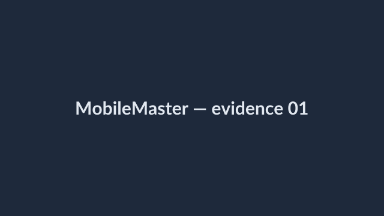
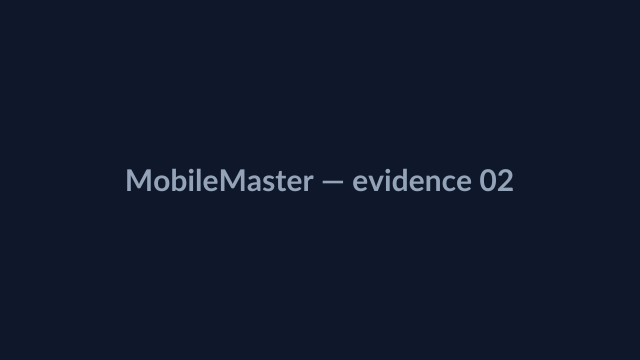

# MobileMaster

## Для чего проект

**MobileMaster** — стартовый репозиторий для **автоматизированного UI-тестирования мобильных приложений** (нативных и гибридных) на **Android** и **iOS** из одной кодовой базы. Он нужен, чтобы:

- поднять **WebdriverIO + Appium** и стабильно гонять сценарии на эмуляторе, симуляторе или реальных устройствах;
- автоматически собирать **улики прогона** (запись экрана на каждый тест, скриншоты) — удобно для разбора дефектов и для передачи контекста внешним инструментам (в том числе ИИ);
- вести **смоки и регрессию** без отдельной инфраструктуры «только Android» / «только iOS»;
- при необходимости стыковать проверки в приложении с **API/БД** (заготовка `src/integration/api-master.ts`).

Технически это **каркас WebdriverIO + Appium** с одним конфигом **`wdio.conf.ts`** для **Android** и **iPhone (iOS)**.

**Разработчик проекта: [Space108] — AI Developer & AI Full-stack Quality**

## Скриншоты

Примеры того, как в проекте фиксируются артефакты прогона (папка `evidence/screenshots/` после тестов; здесь — иллюстрация для README):

<p align="center">
  
  &nbsp;
  
</p>

Файлы: [`readme-screen-1.png`](evidence/demo/readme-screen-1.png), [`readme-screen-2.png`](evidence/demo/readme-screen-2.png).

## Android и iPhone — что нужно

| | **Android** | **iPhone (iOS)** |
|---|-------------|------------------|
| ОС для запуска симулятора | Windows / macOS / Linux | **Только macOS** (Xcode + Simulator) |
| Сборка приложения | `.apk` (эмулятор или устройство) | `.app` для Simulator; на реальный iPhone — `.ipa` + подпись, `IOS_UDID` |
| Драйвер Appium | `uiautomator2` | `xcuitest` |
| Путь к приложению | `ANDROID_APP_PATH` или `app/android/app.apk` | `IOS_APP_PATH` или `app/ios/MyApp.app` |
| Запуск всех тестов | `npm run test:android` | `npm run test:ios` |
| Подряд обе платформы | `npm run test:all` (сначала Android, потом iOS; **iOS на машине без Mac не взлетит**) | |

Переменные **`PLATFORM=android`** и **`PLATFORM=ios`** переключают секцию capabilities в **`wdio.conf.ts`**.

## Пошаговая настройка

### 1. Appium 2.x и оба драйвера

```bash
npm install -g appium
appium driver install uiautomator2
appium driver install xcuitest
appium driver list --installed
```

Сервер при `npm run test:*` поднимается через **`@wdio/appium-service`** (порт по умолчанию **4723**).

### 2. Appium Inspector

[Релизы Appium Inspector](https://github.com/appium/appium-inspector/releases) — снимайте селекторы отдельно для макета Android и для iOS.

### 3. Проект

```bash
npm install
```

### 4. Папка `evidence/`

- **`evidence/recordings/`** — видео после **каждого** теста (хуки `beforeTest` / `afterTest` в `wdio.conf.ts`).
- **`evidence/screenshots/`** — PNG после **каждого** теста (тот же `afterTest`); отдельно можно вызывать `saveEvidenceScreenshot` из `src/evidence/screenshots.ts`.
- **`evidence/appium-server.log`** — лог Appium.
- **`evidence/demo/`** — демо для репозитория: скрины для README (`readme-screen-*.png`), миниатюры `demo-after-test-*.png`, видео [`demo-recording-sample.mp4`](evidence/demo/demo-recording-sample.mp4) ([raw](https://raw.githubusercontent.com/Space108/MobileMaster/main/evidence/demo/demo-recording-sample.mp4)); подробнее — [`evidence/demo/README.md`](evidence/demo/README.md).

Крупные скриншоты для главной страницы репозитория — в разделе **«Скриншоты»** выше.

### 5. Тесты (кроссплатформенные)

| Файл | Описание |
|------|----------|
| `tests/app-launch.stub.ts` | Заглушка: приложение открыто |
| `tests/login.test.ts` | Кнопка «Войти» (текст: `E2E_LOGIN_BUTTON_TEXT`) |

Быстрый прогон только заглушки:

- Android: `npm run test:stub:android`
- iPhone: `npm run test:stub:ios`

Только login:

- Android: `npm run test:login` или `npm run test:login:android`
- iPhone: `npm run test:login:ios`

## Переменные окружения (важное)

**Общие:** `APPIUM_PORT`, `APPIUM_NO_RESET=false`

**Android:** `ANDROID_APP_PATH`, `ANDROID_DEVICE_NAME`, `ANDROID_PLATFORM_VERSION`, `ANDROID_APP_PACKAGE`, `ANDROID_APP_ACTIVITY`

**iPhone:** `IOS_APP_PATH`, `IOS_DEVICE_NAME` (как в Simulator), `IOS_PLATFORM_VERSION`, `IOS_BUNDLE_ID`, `IOS_UDID` (реальное устройство), при необходимости `IOS_XCODE_ORG_ID`, `IOS_XCODE_SIGNING_ID`

Подробности — комментарии в **`wdio.conf.ts`**.

## Публикация на GitHub

Репозиторий: **[github.com/Space108/MobileMaster](https://github.com/Space108/MobileMaster)**.

Если меняли файлы локально, отправьте коммит:

```bash
git remote add origin https://github.com/Space108/MobileMaster.git
# если origin уже есть:
# git remote set-url origin https://github.com/Space108/MobileMaster.git
git add -A && git commit -m "chore: evidence/demo + README preview" && git push -u origin main
```

(SSH: `git@github.com:Space108/MobileMaster.git`.)
